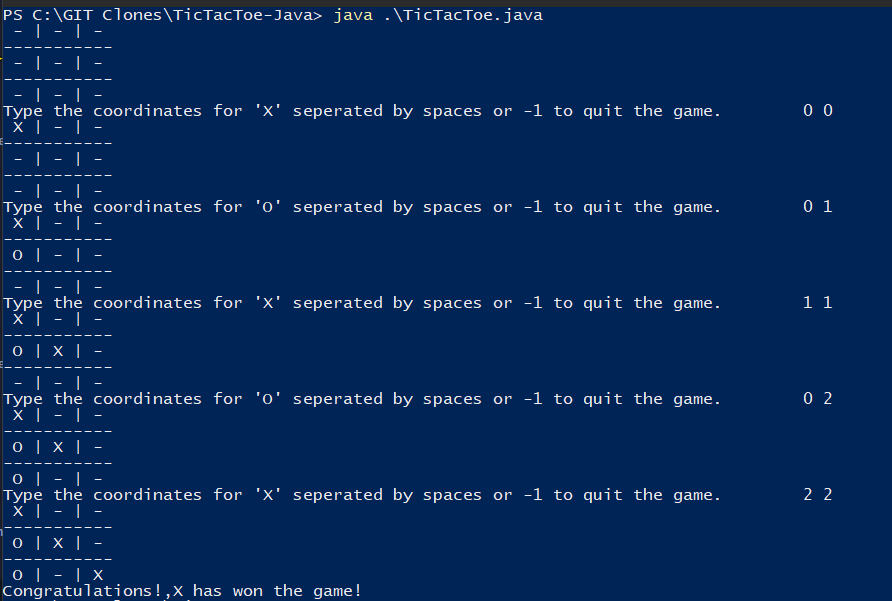

# Tic Tac Toe Overview

This is a java program that allows the user to play the game Tic Tac Toe. The program draws a rudimentary board to the terminal and prompts the "X" player to type the coordinates for their move, then displays the "X" in the correct position. The program does the same for the "O" player as well. When either player has won or the game has ended in a draw, the program will display a relevant message and cease execution.

## Screenshot of the Gameplay
